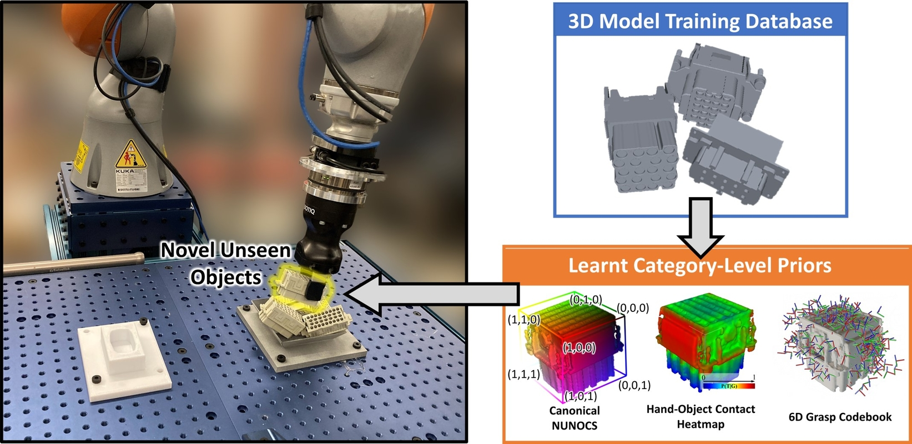
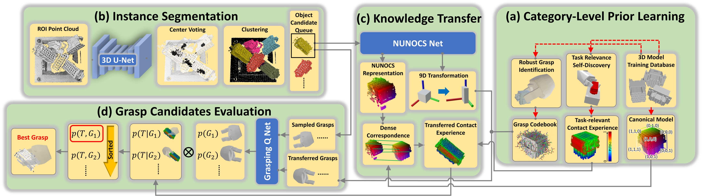
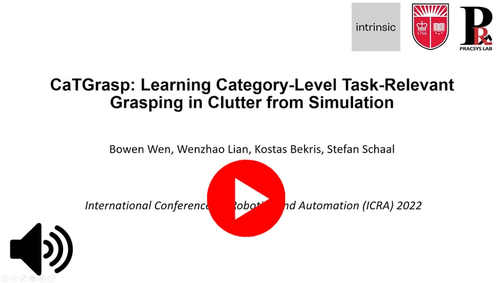
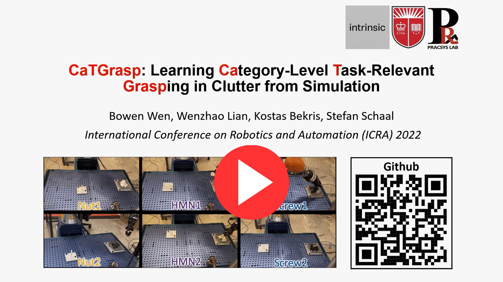
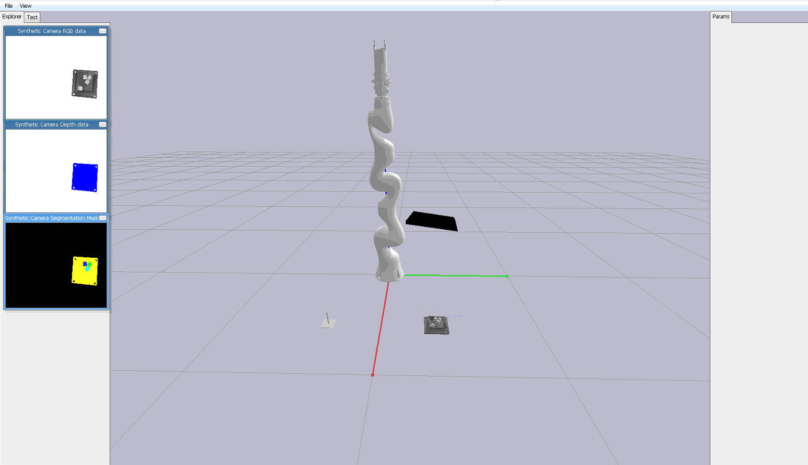
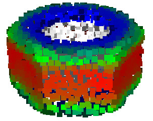
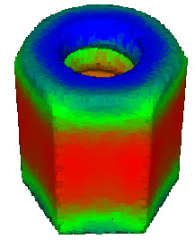

This is the official implementation of our paper:

Bowen Wen, Wenzhao Lian, Kostas Bekris, and Stefan Schaal. ["CaTGrasp: Learning Category-Level Task-Relevant Grasping in Clutter from Simulation."](https://arxiv.org/abs/2109.09163) IEEE International Conference on Robotics and Automation (ICRA) 2022.


<p align="center" width="100%">
  
</p>


<p align="center">
  
  
</p>


# Abstract
Task-relevant grasping is critical for industrial assembly, where downstream manipulation tasks constrain the set of valid grasps. Learning how to perform this task, however, is challenging, since task-relevant grasp labels are hard to define and annotate. There is also yet no consensus on proper representations for modeling or off-the-shelf tools for performing task-relevant grasps. This work proposes a framework to learn task-relevant grasping for industrial objects without the need of time-consuming real-world data collection or manual annotation. To achieve this, the entire framework is trained solely in simulation, including supervised training with synthetic label generation and self-supervised, hand-object interaction. In the context of this framework, this paper proposes a novel, object-centric canonical representation at the category level, which allows establishing dense correspondence across object instances and transferring task-relevant grasps to novel instances. Extensive experiments on task-relevant grasping of densely-cluttered industrial objects are conducted in both simulation and real-world setups, demonstrating the effectiveness of the proposed framework.


# Bibtex
```bibtex
@article{wen2021catgrasp,
  title={CaTGrasp: Learning Category-Level Task-Relevant Grasping in Clutter from Simulation},
  author={Wen, Bowen and Lian, Wenzhao and Bekris, Kostas and Schaal, Stefan},
  journal={ICRA 2022},
  year={2022}
}
```


# Supplementary Video
Click to watch

[](https://www.youtube.com/watch?reload=9&v=rAX-rFSKAto)


# ICRA 2022 Presentation Video

[](https://www.youtube.com/watch?v=hFK8JfR5ZO0)


# Quick Setup
We provide docker environment and setup is as easy as below a few lines.

- If you haven't installed docker, firstly install (https://docs.docker.com/get-docker/).

- Run
  ```
  docker pull wenbowen123/catgrasp:latest
  ```

- To enter the docker, run below
  ```
  cd  docker && bash run_container.sh
  cd /home/catgrasp && bash build.sh
  ```
  Now the environment is ready to run training or testing.


# Data
- [Download object models and pretrained network weights from here](https://archive.cs.rutgers.edu/pracsys/catgrasp/). Then extract and replace the files in this repo, to be like:
```
  catgrasp
  ├── artifacts
  ├── data
  └── urdf
```

# Testing
`python run_grasp_simulation.py`

You should see the demo starting like below. You can play with the settings in config_run.yml, including changing different object instances within the category while using the same framework

<p align="left">
  
</p>


# Training

In the following, we take the `nut` category as an example to walk through


- Compute signed distance function for all objects of the category
  ```
  python make_sdf.py --class_name nut
  ```

- Pre-compute offline grasps of training objects. This generates and evaluates grasp qualities regardless of their task-relevance. To visualize and debug the grasp quality evaluation change to `--debug 1`
  ```
  python generate_grasp.py --class_name nut --debug 0
  ```

- Self-supervised task-relevance discovery in simulation
  ```
  python pybullet_env/env_semantic_grasp.py --class_name nut --debug 0
  ```
  Changing `--debug 0` to `--debug 1`, you are able to debug and visualize the process
  <p align="left">
    
  </p>

  The affordance results will be saved in `data/object_models`. The heatmap file `XXX_affordance_vis` can be visualized as in the below image, where warmer area means higher task-relevant grasping region P(T|G)

  <p align="left">
    
  </p>

- Make the canonical model that stores category-level knowledge
  ```
  python make_canonical.py --class_name nut
  ```
  <p align="left">
    
  </p>


- Training data generation of piles
  ```
  python generate_pile_data.py --class_name nut
  ```

  <p align="left">
    
  </p>

- Process training data, including generating ground-truth labels
  ```
  python tool.py
  ```

- To train NUNOCS net, examine the settings in  `config_nunocs.yml`, then
  ```
  python train_nunocs.py
  ```

- To train grasping-Q net, examine the settings in  `config_grasp.yml`, then
  ```
  python train_grasp.py
  ```


- To train instance segmentation net, examine the settings in `PointGroup/config/config_pointgroup.yaml`, then
  ```
  python train_pointgroup.py
  ```